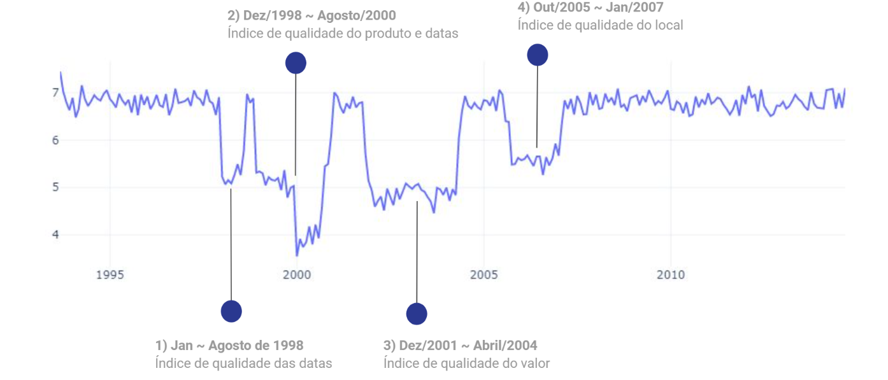

# Data Quality Analysis 

Analysis developed to Data Government class during my MBA of Big Data and Data Science studies at FIAP. The main objective of this analysis was identify and describe data quality problems.

Artefacts:
- [Notebook of analysis](notebooks/data_quality_analysis.ipynb)
- [Presentation of results](Presentation.pdf)

